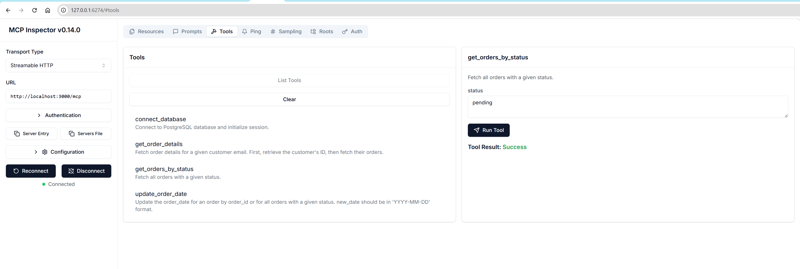

# MCP Database Server

A Model Context Protocol (MCP) server that provides database connectivity and operations for PostgreSQL databases. This server allows MCP clients to connect to databases, execute queries, and manage database connections through a standardized interface.



## Features

- **Database Connection Management**: Connect to PostgreSQL databases with configurable parameters
- **Query Execution**: Execute SQL queries with optional result fetching
- **Connection Status Monitoring**: Check database connection health
- **Secure Parameter Handling**: Database credentials passed as tool parameters (not environment variables)
- **Error Handling**: Comprehensive error handling and logging
- **AWS Deployment Ready**: Includes Docker containerization and AWS deployment scripts

## Quick Start

### Local Development

1. **Install Dependencies**
   ```bash
   pip install -r requirements.txt
   ```

2. **Run the Server**
   ```bash
   python mcp_db_server.py
   ```

3. **Test with Client**
   ```bash
   python mcp_client_example.py
   ```

### Docker Deployment

1. **Build Docker Image**
   ```bash
   docker build -t mcp-database-server .
   ```

2. **Run with Docker Compose**
   ```bash
   docker-compose up -d
   ```

## Available Tools

### `connect_database`
Connect to a PostgreSQL database.

**Parameters:**
- `dbhost` (string, required): Database host
- `dbuser` (string, required): Database username  
- `dbpass` (string, required): Database password
- `dbname` (string, required): Database name
- `application_name` (string, optional): Application name for connection

**Example:**
```python
await client.call_tool("connect_database", {
    "dbhost": "localhost",
    "dbuser": "myuser",
    "dbpass": "mypassword", 
    "dbname": "mydatabase",
    "application_name": "my-app"
})
```

### `execute_query`
Execute SQL queries on the connected database.

**Parameters:**
- `query` (string, required): SQL query to execute
- `fetch_results` (boolean, optional): Whether to fetch and return results (default: true)

**Example:**
```python
await client.call_tool("execute_query", {
    "query": "SELECT * FROM orders WHERE active = true",
    "fetch_results": true
})
```

### `get_connection_status`
Get the current database connection status.

**Parameters:** None

**Example:**
```python
await client.call_tool("get_connection_status", {})
```

### `disconnect_database`
Disconnect from the current database.

**Parameters:** None

**Example:**
```python
await client.call_tool("disconnect_database", {})
```

## AWS Deployment

### Prerequisites

1. **AWS CLI Configuration**
   ```bash
   aws configure
   ```

2. **Docker Installation**
   ```bash
   # Install Docker on your local machine
   ```

3. **Required AWS Permissions**
   - ECR: Create repositories, push/pull images
   - ECS: Create clusters, services, task definitions
   - IAM: Create roles and policies
   - VPC: Access to subnets and security groups

### Deployment Options

#### Option 1: ECS with Fargate (Recommended)

1. **Quick Deployment**
   ```bash
   chmod +x deploy.sh
   ./deploy.sh deploy
   ```

2. **Step-by-Step Deployment**
   ```bash
   # Build and push to ECR
   ./deploy.sh build-push
   
   # Create IAM roles
   ./deploy.sh create-roles
   
   # Deploy ECS service (update subnet/security group IDs first)
   ./deploy.sh deploy-ecs
   ```

#### Option 2: CloudFormation (Infrastructure as Code)

1. **Update Parameters**
   Edit the CloudFormation template with your VPC and subnet IDs.

2. **Deploy Stack**
   ```bash
   aws cloudformation create-stack \
     --stack-name mcp-database-server \
     --template-body file://cloudformation-template.yaml \
     --parameters ParameterKey=VpcId,ParameterValue=vpc-12345678 \
                  ParameterKey=SubnetIds,ParameterValue="subnet-12345678,subnet-87654321" \
                  ParameterKey=ImageUri,ParameterValue="123456789012.dkr.ecr.us-east-1.amazonaws.com/mcp-database-server:latest" \
     --capabilities CAPABILITY_IAM
   ```

#### Option 3: EC2 Instance

```bash
./deploy.sh deploy-ec2
```

#### Option 4: AWS Lambda

```bash
./deploy.sh deploy-lambda
```

### Configuration

#### Environment Variables (Optional)
While the server takes database credentials as tool parameters, you can also use environment variables for default configuration:

```bash
export PYTHONUNBUFFERED=1
```

#### Security Groups
The deployment scripts create a security group that allows:
- Inbound TCP traffic on port 8080 (for HTTP transport, if implemented)
- Outbound traffic to database servers

#### IAM Roles
The deployment creates the following IAM roles:
- `ecsTaskExecutionRole`: For ECS task execution
- `ecsTaskRole`: For application-specific permissions

## Security Considerations

1. **Credential Management**
   - Database credentials are passed as tool parameters, not stored in environment variables
   - Consider using AWS Secrets Manager or Parameter Store for production deployments
   - Implement proper access controls and network security

2. **Network Security**
   - Deploy in private subnets when possible
   - Use security groups to restrict database access
   - Consider VPC endpoints for AWS services

3. **Logging and Monitoring**
   - All database operations are logged
   - Use CloudWatch for monitoring in AWS deployments
   - Implement log aggregation and analysis

## Monitoring and Troubleshooting

### Logs

#### Local Development
```bash
# Server logs are printed to stdout
python mcp_db_server.py

# Enable debug logging
export PYTHONUNBUFFERED=1
python mcp_db_server.py
```

#### AWS ECS
```bash
# View logs via AWS CLI
aws logs get-log-events \
  --log-group-name /ecs/mcp-database-server \
  --log-stream-name ecs/mcp-db-server/TASK_ID

# Or use CloudWatch console
```

### Health Checks

The server provides connection status through the `get_connection_status` tool:

```python
status = await client.call_tool("get_connection_status", {})
print(status[0]['text'])
```

### Common Issues

1. **Connection Timeouts**
   - Check database host and port accessibility
   - Verify security group rules
   - Test database connectivity from server location

2. **Authentication Failures**
   - Verify database credentials
   - Check database user permissions
   - Ensure database allows connections from server IP

3. **Query Execution Errors**
   - Check SQL syntax
   - Verify table and column names
   - Review database user permissions

## Development

### Project Structure
```
mcp-database-server/
├── mcp_db_server.py          # Main MCP server implementation
├── mcp_client_example.py     # Example client usage
├── requirements.txt          # Python dependencies
├── Dockerfile               # Docker container definition
├── docker-compose.yml       # Docker Compose configuration
├── deploy.sh               # AWS deployment script
├── cloudformation-template.yaml  # CloudFormation template
└── README.md               # This file
```

### Adding New Features

1. **New Tools**
   - Add tool definition in `handle_list_tools()`
   - Implement tool logic in `handle_call_tool()`
   - Update documentation

2. **New Database Support**
   - Modify connection string format
   - Update dependencies in `requirements.txt`
   - Test with new database type

### Testing

1. **Unit Tests**
   ```bash
   # Create test database
   createdb test_mcp_db
   
   # Run tests
   python -m pytest tests/
   ```

2. **Integration Tests**
   ```bash
   # Test with real database
   python mcp_client_example.py
   ```

## Contributing

1. Fork the repository
2. Create a feature branch
3. Make your changes
4. Add tests
5. Update documentation
6. Submit a pull request

## License

This project is licensed under the MIT License - see the LICENSE file for details.

## Support

For issues and questions:
1. Check the troubleshooting section
2. Review AWS CloudWatch logs
3. Create an issue in the repository

## Changelog

### v1.0.0
- Initial release
- PostgreSQL support
- AWS deployment scripts
- Docker containerization
- MCP protocol implementation